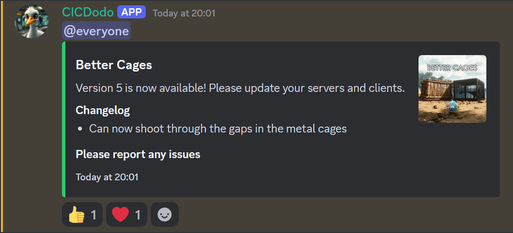

# CICDodo

A Discord bot that monitors CurseForge mods and announces new releases to specified Discord channels.

## Creating a Discord Bot

To run CICDodo you'll need a bot that can send messages, follow these instructions to create one:
https://discordpy.readthedocs.io/en/stable/discord.html

## Configuration

Before running the bot, you need to create a `.env` file with your configuration. Use the provided `.env.example` as a template:

```bash
# Copy the example environment file
cp .env.example .env
```

Then edit the `.env` file with your settings:

- `MOD_IDS`: Comma-separated list of CurseForge mod IDs to monitor
- `DEBUG_CHANNEL_ID`: Discord channel ID for debug messages
- `RELEASES_CHANNEL_ID`: Discord channel ID for release announcements
- `BOT_TOKEN`: Your Discord bot token
- `CURSEFORGE_API_KEY`: Your CurseForge API key
- Additional optional settings are available in the `.env.example` file

## Running the Bot

### Option 1: Docker Compose (Recommended)

```yaml
# docker-compose.yml
services:
  bot:
    image: ghcr.io/jordan-dalby/cicdodo:latest
    volumes:
      - ./releases:/app/releases/
    env_file:
      - .env
    restart: unless-stopped
```

```bash
# Pull and run the container
docker-compose up -d

# View logs
docker-compose logs -f
```

### Option 2: Docker CLI

```bash
# Run the container
docker run -d \
  --name cicdodo \
  --restart unless-stopped \
  -v ./releases:/app/releases \
  --env-file .env \
  ghcr.io/jordan-dalby/cicdodo:latest
```

### Option 3: Unraid

1. Access the Unraid Community Applications
2. Search for "CICDodo"
3. Click "Install"
4. Configure the following variables:
   - Discord Bot Token
   - CurseForge API Key
   - Debug Channel ID
   - Releases Channel ID
   - Mod IDs (comma-separated)
5. Click "Apply"

## Data Persistence

The bot stores release information in the `./releases` directory, which is mounted as a volume in both Docker configurations. This ensures that release tracking persists across container restarts.

## Updating

### Docker Compose
```bash
docker-compose pull
docker-compose up -d
```

### Docker CLI
```bash
docker pull ghcr.io/jordan-dalby/cicdodo:latest
docker stop cicdodo
docker rm cicdodo
docker run -d \
  --name cicdodo \
  --restart unless-stopped \
  -v ./releases:/app/releases \
  --env-file .env \
  ghcr.io/jordan-dalby/cicdodo:latest
```

### Unraid
Updates can be installed through the Unraid web interface when they become available.


